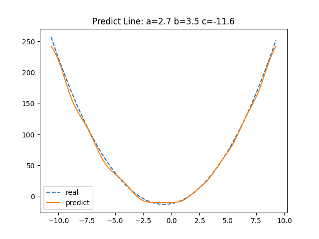
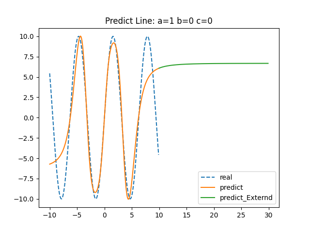

## Quadratic Neural Network

二次函数的神经网络训练

## Project Version

|Lib|Version|
|---|---|
|Python |3.10.2|
|numpy|1.24.2|
|matplotlib|3.7.1|
                
## Result

对一般函数曲线也适用，自行调节节点参数即可，以三角函数为例：

